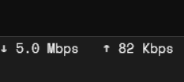
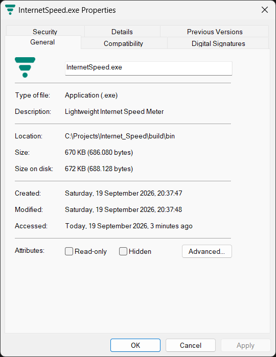

# Internet Speed

<p align="center">
  
</p>

A small Windows app that shows your current download and upload speed directly on the taskbar.

I made it to keep things simple: just the speed meter, running quietly in the background.

## Screenshot



## File Info



The current Release build is a portable Windows x64 executable. No installer is required.

## Features

- Realtime download speed
- Realtime upload speed
- Lightweight native Windows app
- Space Mono font embedded in the executable
- Portable `.exe`
- Right-click menu with Exit

## Download

Download the latest `InternetSpeed-win-x64.exe` from the GitHub Releases page and run it directly.

## Build

This project uses CMake, Ninja, and MSVC.

```powershell
cmake -S . -B build -G Ninja -DCMAKE_BUILD_TYPE=Release -DCMAKE_CXX_COMPILER=cl.exe
cmake --build build
```

The executable is generated at:

```text
build/bin/InternetSpeed.exe
```

## Notes

The app does not provide graphs, history, ping monitoring, or other extra dashboards. It is intended to stay focused on showing current download and upload speed.
