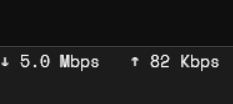

# Internet Speed

<p align="center">
  
</p>

<p align="center">
  <a href="https://github.com/fadd3079-prog/Internet_Speed/releases/latest"></a>
  
  
</p>

A small, native internet speed meter. No graphs, no history, no dashboards —
just your current download and upload speed, running quietly in the background.

- **Windows** — shows realtime speed directly on the taskbar (pure Win32, zero dependencies)
- **Linux** — shows realtime speed as a system tray icon (Qt 6, StatusNotifierItem)

## Screenshot (Windows)



## Download

Grab the latest release from the
[Releases page](https://github.com/fadd3079-prog/Internet_Speed/releases/latest):

| File | Platform | Notes |
|---|---|---|
| `InternetSpeed-win-x64.exe` | Windows x64 | Portable, no installer required |
| `InternetSpeed-linux-x64` | Linux x64 | Requires Qt 6 |

## Features

- Realtime download and upload speed
- Lightweight native app on both platforms
- Right-click menu with Exit
- Windows: Space Mono font embedded in the executable

## Build

### Windows

Requires CMake, Ninja and MSVC.

```powershell
cmake -S . -B build -G Ninja -DCMAKE_BUILD_TYPE=Release -DCMAKE_CXX_COMPILER=cl.exe
cmake --build build
```

The executable is generated at `build/bin/InternetSpeed.exe`.

### Linux

Requires CMake, Ninja and Qt 6.

```bash
cmake -S . -B build -G Ninja -DCMAKE_BUILD_TYPE=Release
cmake --build build
```

The executable is generated at `build/bin/InternetSpeed`.

## Releases

Windows binaries are built automatically by GitHub Actions on every version tag
(`v*`). Linux binaries are built from the same tag.

## License

MIT — see [LICENSE](LICENSE).
